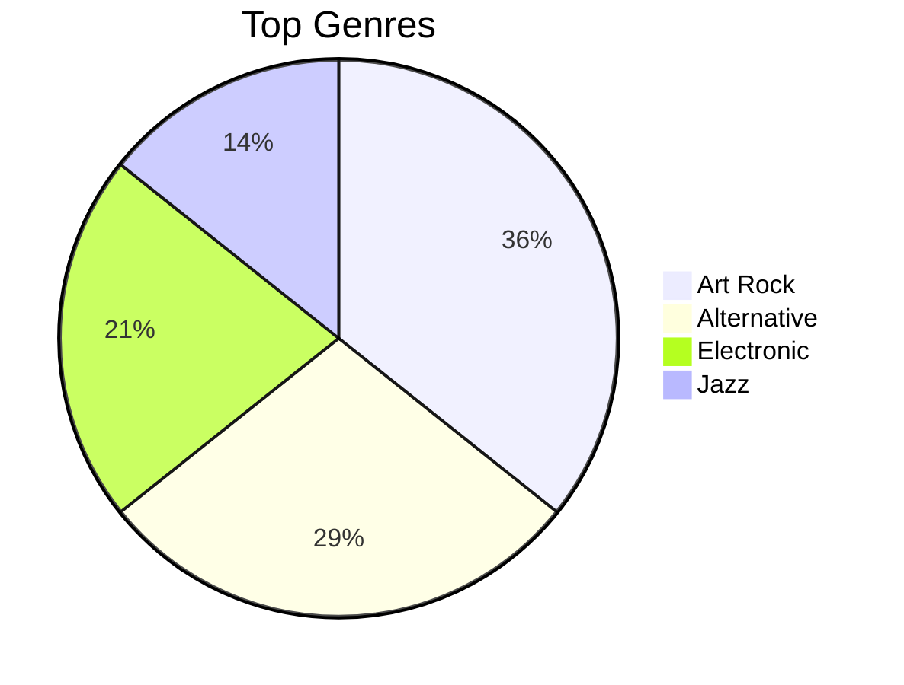

# Which Vinyl Should I Buy?

## Available MCP Tools

### Core Data Tools
| Tool | Description |
|------|-------------|
| `get_spotify_top_tracks` | Top tracks (short/medium/long term) with popularity scores |
| `get_spotify_recently_played` | Last 50 played tracks with timestamps |
| `get_discogs_collection` | User's vinyl collection |

### Listening Habits & Visualization Tools
| Tool | Description | Visualization Data |
|------|-------------|-------------------|
| `get_spotify_top_artists` | Top artists with genres, popularity, followers | `genreBreakdown`, `averagePopularity` |
| `get_saved_albums` | User's saved Spotify albums | `timelineByMonth`, `byDecade`, `topArtists` |
| `get_saved_tracks` | User's liked tracks | `topArtists`, `topAlbums`, `timelineByMonth` |
| `get_followed_artists` | Artists the user follows | `genreBreakdown`, `popularityDistribution` |
| `get_user_playlists` | User's playlists | `sizeDistribution`, `visibility` |
| `get_listening_history_stats` | Aggregated stats for taste evolution | `tasteEvolution`, `genreShifts`, `popularityTrend` |

## Workflow

1. **Fetch data** via MCP tools:
   - `get_spotify_top_tracks(time_range: "short_term")` - Recent listening preferences
   - `get_spotify_recently_played()` - Active listening patterns
   - `get_discogs_collection()` - Existing vinyl collection

2. **Analyze patterns**: Identify favorite artists, genres (rock/jazz/electronic), eras (60s/80s/modern), and listening style (deep cuts vs. hits)

3. **Generate 5-7 recommendations** that:
   - Match Spotify listening patterns
   - Exclude albums already in Discogs collection
   - Prioritize albums with strong vinyl pressings or audiophile editions
   - Mix: Artists they love + similar discoveries + genre classics

4. **Format each recommendation**:
   ```
   Artist - Album (Year)
   Why: [1-2 sentences connecting to their listening habits]
   Vinyl notes: [Pressing quality, availability, or special editions]
   ```

## Creating Visualizations

When users request visual analysis of their listening habits, use the aggregated data from tools to generate charts.

### Genre Analysis
Use `get_spotify_top_artists` or `get_listening_history_stats` for genre data:
- **Pie/donut chart**: Show `genreBreakdown` as proportional slices
- **Bar chart**: Compare genre frequencies across time ranges

### Listening Timeline
Use `get_saved_albums` or `get_saved_tracks` for timeline data:
- **Line chart**: Plot `timelineByMonth` to show collection growth
- **Calendar heatmap**: Visualize saving activity by date

### Taste Evolution
Use `get_listening_history_stats` for comparison data:
- **Side-by-side bar chart**: Compare `shortTermGenres` vs `longTermGenres`
- **Lists**: Show `newObsessions`, `consistentFavorites`, `fadedFavorites`

### Visualization Formats
Generate visualizations as:
- **Mermaid diagrams** (pie charts, bar charts)
- **ASCII art** for terminal-friendly output
- **HTML/Canvas** for rich interactive charts
- **SVG** for scalable graphics

### Example: Genre Pie Chart (Mermaid)


## Example

Based on your recent Spotify listening (Radiohead, Portishead, Massive Attack) and your 47-record Discogs collection:

**1. Boards of Canada - Music Has the Right to Children** (1998)
Your love of atmospheric, electronic-tinged music makes this essential. Excellent vinyl pressing with deep bass response.

**2. Talk Talk - Spirit of Eden** (1988)
Given your Radiohead affinity, this pioneering post-rock album is a must. The 2012 vinyl remaster is definitive.

## Edge Cases

- **Limited Spotify data**: Weight toward Discogs collection analysis (identify gaps in their collection)
- **Empty Discogs collection**: Focus purely on Spotify-based recommendations
- **Duplicate ownership**: Acknowledge when recommended albums relate to ones they already own
- **Visualization requests**: Use the aggregated stats from tools (genreBreakdown, timelineByMonth, etc.) to generate charts
